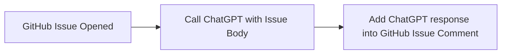

# GitHub Action - Call ChatGPT with GitHub Issue Open event Sample

### About
Simple Sample Code for GitHub Action with ChatGPT API<br>
Flow: 


### Language
GitHub Action YAML & Python

### Usage
Step1. Get OpenAPI Key<br>
https://platform.openai.com/account/api-keys

Step2. Add OpenAPI Key to your Secret<br>
https://docs.github.com/en/actions/security-guides/encrypted-secrets?tool=webui

Step3. Call GitHub Action<br>
Use call-chatgpt-sample.yml for sample
```
name: call-chatgpt-sample
on:
  issues:
    types: [opened]
jobs:
  call-chatgpt:
    runs-on: ubuntu-latest
    steps:
      - uses: actions/checkout@v2
      - name: Setup Python
        uses: actions/setup-python@v2
        with:
          python-version: '3.8'
          architecture: 'x64'
      - name: Get Python version
        run: python -V
      - name: Install dependencies
        run: pip install -r requirements.txt
      - name: Run Python
        env:
          OPENAI_API_KEY: ${{ secrets.OPENAI_API_KEY }}
          GITHUB_TOKEN: ${{ secrets.GITHUB_TOKEN }}
          GITHUB_URL: ${{ github.event.issue.comments_url }}
          BODY: ${{ github.event.issue.body }}
        run: python action.py
        
```

### Sample Screenshot


